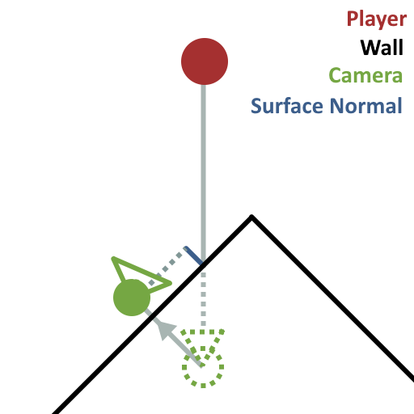
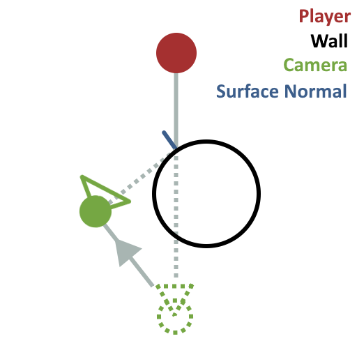

# Wrong Side Up
 A 3D platformer game made in Godot 4.2.1 for Acerola Jam 0 in which the world distorts as the player progresses.

The game can be downloaded or played in your browser on [Itch.io](https://pc-hris.itch.io/wrong-side-up)

The physics smoothing plugin was made by somebody else online but all the rest of the code and all of the art was made by me.
Most textures were created procedurally using a program called Material Maker.
Models were all made in Blender.

## What makes this project interesting

The character controller was code I had already written for another project but modified for this one. It took a lot of work to make it work properly with an arbitrary orientation/direction of gravity. The math for doing something like that is made much more complex.

For instance; to make the character rise during a jump slower than they fall I had to detect when the player reaches the apex of their jump and increase the strength of gravity once they do. To do this originally, I simply checked if their Y velocity was < 0 and if so, increased gravity. This doesn't work if the player isn't jumping on the Y-axis anymore because the world is flipped sideways. A lot more vector projection needed to be used in this project.

The camera controller is also pretty interesting. Some players complained about how it could be a little unpredictable but from a technical angle I think it's a fairly clever design, though hard to explain.

The camera controller has a desired direction (at a 45-degree angle and about 15 degrees up) and distance from the player it wants to be at. It then shoots a raycast from the player character's position to this desired camera position. (Where it's shooting from and to are important.) A more simple camera controller might just move the camera in slightly closer to the character to avoid being obscured by an obstacle but I wanted to do more than this. The raycast got the surface normal of whatever was in the way of the camera. The camera controller uses this surface normal and projects the camera's desired position onto that plane. This causes the camera to move to the side or up to look around obstacles, and to only zoom in as much as is needed.

 

Since this new position for the camera could also be obstructed, it shoots another raycast from the character to its new position and just goes with the simple move-closer-to-the-character approach if it's obstructed at its new location.

The results I think are very satisfying as the camera will move around obstacles to get a better view of the character.

# Screenshots

